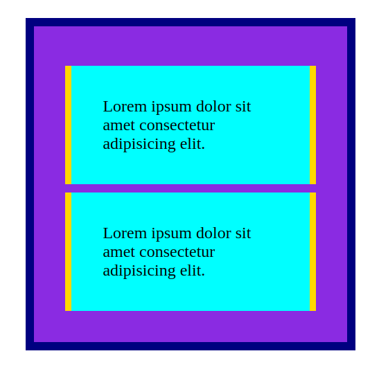

# CSS0154

* Szerző: Sallai András
* Copyright © 2014, Sallai András
* Szerkesztve: 2014-2024
* Licenc: CC BY-SA 4.0
* Web: https://szit.hu

## Leírás
Ez a projekt egy egyszerű, reszponzív weboldal, amely két rugalmas méretezésű dobozt tartalmaz. A dobozok egy nagyobb konténeren belül helyezkednek el, és az alábbi tulajdonságokkal rendelkeznek:

- Külső doboz:
  - Háttérszíne: **blueviolet**
  - Szegélyének színe: **navy**
- Belső dobozok:
  - Háttérszíne: **aqua**
  - Szélein **gold** színű szegélyek

## Fájlok
- `index.html` – a fő HTML fájl
- `style.css` – a megjelenést szabályzó CSS fájl
- `test_webpage.py` – pytest tesztek a weboldal ellenőrzésére

## Használat
Egyszerűen nyisd meg az `index.html` fájlt egy böngészőben.

